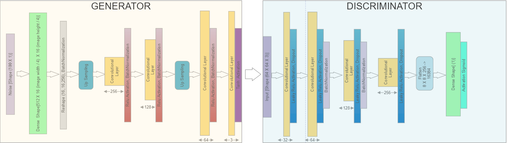

# MLND Capstone Project : Image Generation using Deep Convolutional GAN
This project was built as a capstone project for the Machine Learning Engineer Nanodegree. In this project I use, a deep learning approach to generate human faces. The technique used is called Deep Convolutional Generative Adverserial
Network, which uses a Convolutional neural network as a discriminator and a deconvolutional neural network is as a generator.
The whole idea behind GAN is to have a zero-sum game framework by using two neural networks contesting
with each other. One neural network is the generator and the main task of the generator is
generating new items the other neural network is a discriminator and the task of discriminator is
to distinguish between real and fake items. The items that would be generated by the generator
2 would be fake items since it is trying to mimic the real data items the main goal of the generator
is to make these data items as real as possible so that it can fool the discriminator on the other
hand the goal of discriminator is to distinguish these fake these and real items as best as possible
so here the discriminator works as a adversary judging the real and the fake items. So at the start
the generator produces some fake data items these fake data items are feed into the discriminator
along with the real data items and the discriminator is made to learn which are real and fake. The
results of the discriminator are than further used to improve both the generator and itself.
Backpropagation is used on both the networks so that so that the generator produces better
images, while the discriminator becomes more skilled at flagging data items. (Goodfellow I. ,
2016) This process continues indefinitely and in the end we get two high trained models one that
is highly capable of generating new data items and other that is high capable at distinguishing
these data items.

## Getting Started
1. Clone the entire repositry.
2. Download the aligned and cropped dataset from [here](http://mmlab.ie.cuhk.edu.hk/projects/CelebA.html).
3. Open the Data preparation Jupyter notebook and run each cell to compile the entire dataset into a single numpy array.
4. Run the `DCGAN.py` to start the training process.
5. The results will be stored in the Output folder and the models after every 10,000 epoch will be stored in the models folder.
6. After training, run `Plotting Graphs.py` file to plot the graphs of generator and discriminator losses and the accuracy of the discriminator.

The size of pre-processing the images can be changed in the Data Preparation.ipynb. Note by changing the size of the pre-processed images architecute of GAN has to be tweaked accordingly.
The save interval and the batch size can also be changed in the DCGAN.py file.

The already pre-processed dataset can be found [here](https://drive.google.com/open?id=1NABm6XTteqCn6JKbuaK4WuwTfDrDR13h) and the pre-trained models can be found [here](https://drive.google.com/open?id=1f2oxsDzZpLCqF2XKQO6hVQONY1duG0m3)

## Software Requirements
1. OS
<li>
• Windows / Mac OS / Linux
</li>
2. Software
<li>Python 3.5 or higher.</li>
<li>Tensorflow --suggested to use Tensorflow-gpu</li>
<li>Keras</li>
<li>OpenCV</li>
<li>Numpy</li>
<li>Matplotlib</li>
<li>Pillow</li>
<li>h5py</li>
<li>Scipy</li>
<li>Requirements required for running</li> [HyperGAN](https://github.com/255BITS/HyperGAN) -- To test as a benchmark.

## Architecture

## License

This project is licensed under the MIT License - see the [LICENSE.md](LICENSE.md) file for details
